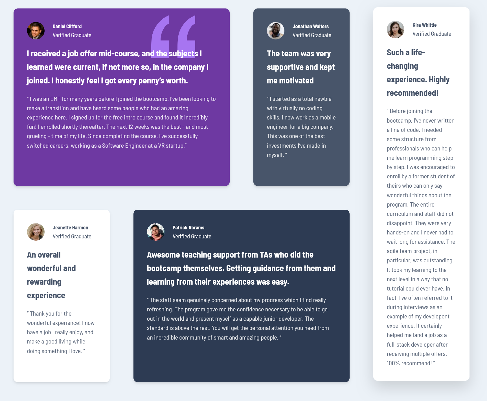

# FRONTEND MENTOR-TESTIMONIAL GRID SOLUTION
This is a solution to the [Testimonials grid section challenge on Frontend Mentor](https://www.frontendmentor.io/challenges/testimonials-grid-section-Nnw6J7Un7). Frontend Mentor challenges help you improve your coding skills by building realistic projects. 

Table of Contents 
-Overview
- [The challenge](#the-challenge)
  - [Screenshot](#screenshot)
  - [Links](#links)
- [My process](#my-process)
  - [Built with](#built-with)
  - [What I learned](#what-i-learned)
  - [Continued development](#continued-development)
  - [Useful resources](#useful-resources)
- [Author](#author)
- [Acknowledgments](#acknowledgments)

## Overview
### The challenge
Users should be able to:

- View the optimal layout for the site depending on their device's screen size
- Experience smooth hover interactions on testimonial cards
- See a fully responsive grid layout that adapts across mobile, tablet, and desktop viewports


### Screenshot


### Links

- Solution URL: [Add solution URL here](https://your-solution-url.com)
- Live Site URL: [Add live site URL here](https://your-live-site-url.com)

## My process
### Built With
- Semantic HTML5 markup
- CSS custom properties
- CSS Grid with named grid areas
- Flexbox for card content layout
- Mobile-first responsive design workflow
- Google Fonts (Barlow Semi Condensed)
- CSS transitions and hover effects

### What I learned
Working on this project reinforced several important CSS concepts:
1. CSS Grid Named Areas
I implemented a sophisticated grid layout using named grid template areas, making the responsive design much more intuitive:
```css.testimonials-grid {
  grid-template-areas:
    'first first second fifth'
    'third fourth fourth fifth';
}```
This approach made it easy to reorganize the layout at different breakpoints without complex positioning logic.

2. Mobile-First Responsive Design
I structured the CSS with a mobile-first approach, progressively enhancing the layout for larger screens:
- Base layout: Single column (mobile)
- 33em (528px): 2-column grid
- 38em (608px): Optimized tablet layout
- 54em (864px): 3-column layout
- 75em (1200px): Full 4-column desktop layout

3. Smooth interactions 
Added  subtle hover effects for better use experience:
```css.card:hover {
  transform: translateY(-3px);
  box-shadow: 0 15px 35px rgba(0, 0, 0, 0.15);}```

### Continued development
Areas I want to focus on in future projects:

- Exploring CSS Grid subgrid for more complex nested layouts
- Implementing CSS container queries for more component-based responsive design
- Adding animations using CSS keyframes or JavaScript libraries
- Experimenting with different grid layout algorithms
- Improving accessibility with ARIA labels and keyboard navigation

### Useful resources

- [useful resource 1](https://css-tricks.com/snippets/css/complete-guide-grid/) - This helped me with a Comprehensive guide to CSS Grid properties
- [useful resource 2](https://www.smashingmagazine.com/2017/06/building-production-ready-css-grid-layout/) - Great insights on mobile-first grid layouts

## Author

- Website - [Bounty](https://portfolio-by-bounty.vercel.app/)
- Frontend Mentor - [@codesbounty](https://www.frontendmentor.io/profile/codesbounty)
- Twitter - [@codes_bounty](https://x.com/codes_bounty)

## Acknowledgments

Thanks to Frontend Mentor for providing this challenge, which helped me deepen my understanding of CSS Grid and responsive design patterns.


